---
## Front matter
title: "Отчёт по лабораторной работе №2"
subtitle: "Дисциплина: архитектура компьютера"
author: "Хамзина Виктория Валентиновна"

## Generic otions
lang: ru-RU
toc-title: "Содержание"

## Bibliography
bibliography: bib/cite.bib
csl: pandoc/csl/gost-r-7-0-5-2008-numeric.csl

## Pdf output format
toc: true # Table of contents
toc-depth: 2
lof: true # List of figures
fontsize: 12pt
linestretch: 1.5
papersize: a4
documentclass: scrreprt
## I18n polyglossia
polyglossia-lang:
  name: russian
  options:
	- spelling=modern
	- babelshorthands=true
polyglossia-otherlangs:
  name: english
## I18n babel
babel-lang: russian
babel-otherlangs: english
## Fonts
mainfont: PT Serif
romanfont: PT Serif
sansfont: PT Sans
monofont: PT Mono
mainfontoptions: Ligatures=TeX
romanfontoptions: Ligatures=TeX
sansfontoptions: Ligatures=TeX,Scale=MatchLowercase
monofontoptions: Scale=MatchLowercase,Scale=0.9
## Biblatex
biblatex: true
biblio-style: "gost-numeric"
biblatexoptions:
  - parentracker=true
  - backend=biber
  - hyperref=auto
  - language=auto
  - autolang=other*
  - citestyle=gost-numeric
## Pandoc-crossref LaTeX customization
figureTitle: "Рис."
tableTitle: "Таблица"
listingTitle: "Листинг"
lofTitle: "Список иллюстраций"
lolTitle: "Листинги"
## Misc options
indent: true
header-includes:
  - \usepackage{indentfirst}
  - \usepackage{float} # keep figures where there are in the text
  - \floatplacement{figure}{H} # keep figures where there are in the text
---

# Цель работы

Ознакомиться с принципами работы и применением средств контроля
версий. Приобрести практические навыки по работе с системой git, создать рабочее
пространство и репозиторий курса.

# Выполнение лабораторной работы

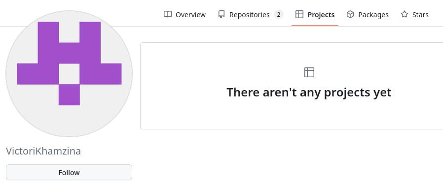{#fig:001 width=100%}

## Базовая настройка Git

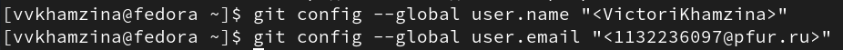{#fig:002 width=100%}

{#fig:003 width=100%}

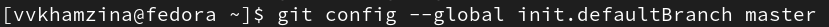{#fig:004 width=100%}

{#fig:005 width=100%}

## Создание SSH-ключа

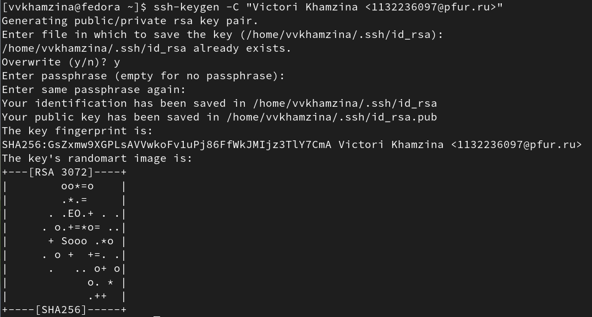{#fig:006 width=100%}

{#fig:007 width=100%}

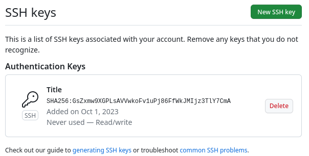{#fig:008 width=100%}

## Создание рабочего пространства

{#fig:009 width=100%}

## Создание репозитория курса на основе шаблона

{#fig:010 width=100%}

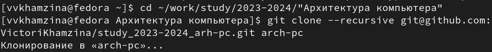{#fig:011 width=100%}

## Настройка каталога курса

{#fig:012 width=100%}

{#fig:013 width=100%}

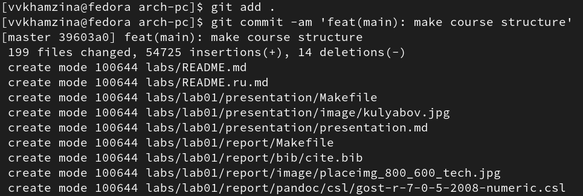{#fig:014 width=100%}

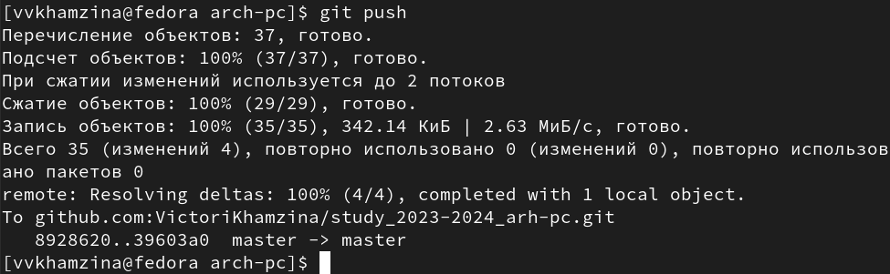{#fig:015 width=100%}

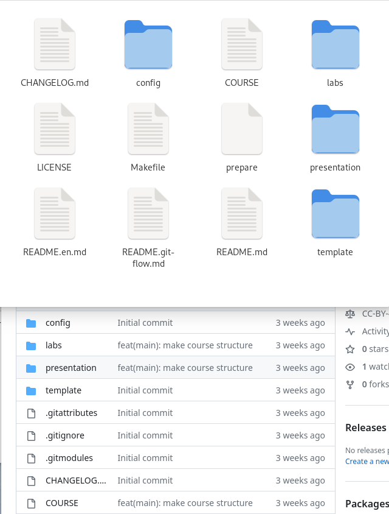{#fig:016 width=100%}

# Задания для самостоятельной работы

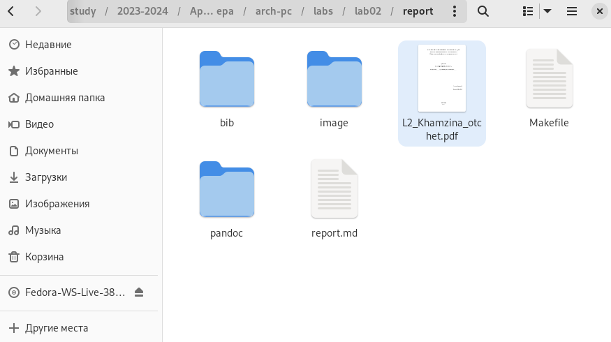{#fig:017 width=100%}

{#fig:018 width=100%}

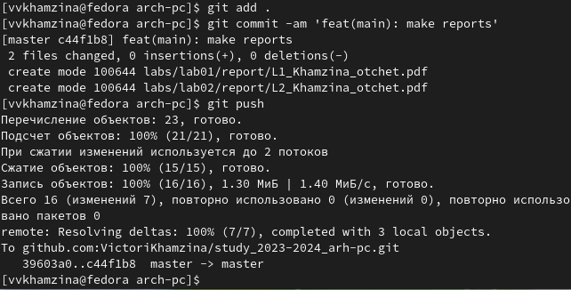{#fig:019 width=100%}

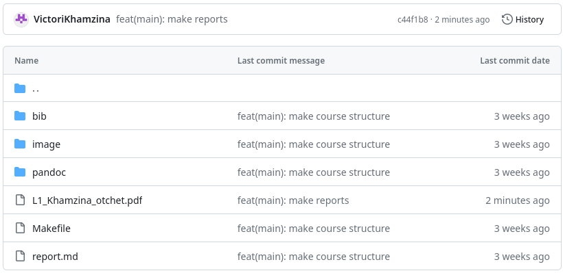{#fig:020 width=100%}

# Вывод

Идеология и применение средств контроля версий изучены. После базовой
настройки git создали иерархию рабочего пространства в локальном репозитории и
на странице github.

