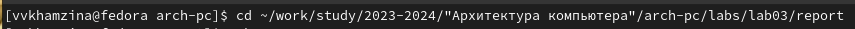
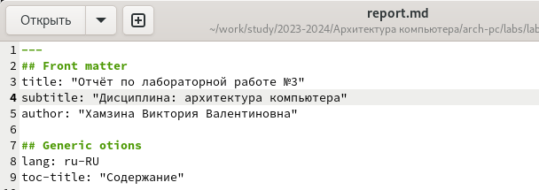
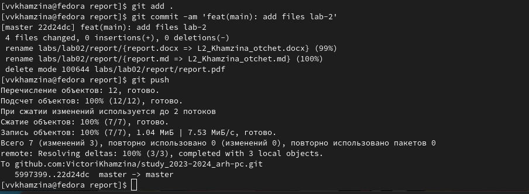

---
## Front matter
title: "Отчёт по лабораторной работе №3"
subtitle: "Дисциплина: архитектура компьютера"
author: "Хамзина Виктория Валентиновна"

## Generic otions
lang: ru-RU
toc-title: "Содержание"

## Bibliography
bibliography: bib/cite.bib
csl: pandoc/csl/gost-r-7-0-5-2008-numeric.csl

## Pdf output format
toc: true # Table of contents
toc-depth: 2
lof: true # List of figures
fontsize: 12pt
linestretch: 1.5
papersize: a4
documentclass: scrreprt
## I18n polyglossia
polyglossia-lang:
  name: russian
  options:
	- spelling=modern
	- babelshorthands=true
polyglossia-otherlangs:
  name: english
## I18n babel
babel-lang: russian
babel-otherlangs: english
## Fonts
mainfont: PT Serif
romanfont: PT Serif
sansfont: PT Sans
monofont: PT Mono
mainfontoptions: Ligatures=TeX
romanfontoptions: Ligatures=TeX
sansfontoptions: Ligatures=TeX,Scale=MatchLowercase
monofontoptions: Scale=MatchLowercase,Scale=0.9
## Biblatex
biblatex: true
biblio-style: "gost-numeric"
biblatexoptions:
  - parentracker=true
  - backend=biber
  - hyperref=auto
  - language=auto
  - autolang=other*
  - citestyle=gost-numeric
## Pandoc-crossref LaTeX customization
figureTitle: "Рис."
tableTitle: "Таблица"
listingTitle: "Листинг"
lofTitle: "Список иллюстраций"
lolTitle: "Листинги"
## Misc options
indent: true
header-includes:
  - \usepackage{indentfirst}
  - \usepackage{float} # keep figures where there are in the text
  - \floatplacement{figure}{H} # keep figures where there are in the text
---

# Цель работы

Освоить процедуру оформления отчетов с помощью легковесного языка разметки Markdown.

# Выполнение лабораторной работы

Открыла терминал. Перешла в каталог курса, сформированный при выполнении прошлой лабораторной работы. Обновила локальный репозиторий с помощью команды git pull (рис. [-@fig:001]).

{#fig:001 width=70%}

Перешла в каталог с шаблоном отчета по данной лабораторной работе (рис. [-@fig:002]).

{#fig:002 width=70%}

Провела компиляцию шаблона с помощью команды make. Проверила, что компиляция прошла успешно (рис. [-@fig:003]).

{#fig:003 width=70%}

Удалила созданные с помощью команды make clean файлы и проверила, что они удалены (рис. [-@fig:004]).

{#fig:004 width=70%}

Открыла файл report.md с помощью команды gedit (рис. [-@fig:005]).

{#fig:005 width=70%}

Заполнила отчет с помощью Marcdown (рис. [-@fig:006]).

{#fig:006 width=70%}

Переименовала файл, провела компиляцию заполненного отчета (рис. [-@fig:007]).

{#fig:007 width=70%}

Загрузила файлы на Github.

# Задание для самостоятельной работы

Перешла в каталог с шаблоном отчета по лабораторной работе №2. Открылы файл report.md командой gedit. Заполнила отчет (рис. [-@fig:008]).

{#fig:008 width=70%}

Переименовывала и провела компиляцию отчета (рис. [-@fig:009]).

{#fig:009 width=70%}

Загрузила файлы на Github (рис. [-@fig:010]).

{#fig:010 width=70%}

# Выводы

В ходе выполнения данной лабораторной работы я освоила процедуру оформления отчетов с помощью легковесного языка разметки Markdown.
