---
## Front matter
title: "Отчёт по лабораторной работе №4"
subtitle: "Дисциплина: архитектура компьютера"
author: "Хамзина Виктория Валентиновна"

## Generic otions
lang: ru-RU
toc-title: "Содержание"

## Bibliography
bibliography: bib/cite.bib
csl: pandoc/csl/gost-r-7-0-5-2008-numeric.csl

## Pdf output format
toc: true # Table of contents
toc-depth: 2
lof: true # List of figures
fontsize: 12pt
linestretch: 1.5
papersize: a4
documentclass: scrreprt
## I18n polyglossia
polyglossia-lang:
  name: russian
  options:
	- spelling=modern
	- babelshorthands=true
polyglossia-otherlangs:
  name: english
## I18n babel
babel-lang: russian
babel-otherlangs: english
## Fonts
mainfont: PT Serif
romanfont: PT Serif
sansfont: PT Sans
monofont: PT Mono
mainfontoptions: Ligatures=TeX
romanfontoptions: Ligatures=TeX
sansfontoptions: Ligatures=TeX,Scale=MatchLowercase
monofontoptions: Scale=MatchLowercase,Scale=0.9
## Biblatex
biblatex: true
biblio-style: "gost-numeric"
biblatexoptions:
  - parentracker=true
  - backend=biber
  - hyperref=auto
  - language=auto
  - autolang=other*
  - citestyle=gost-numeric
## Pandoc-crossref LaTeX customization
figureTitle: "Рис."
tableTitle: "Таблица"
listingTitle: "Листинг"
lofTitle: "Список иллюстраций"
lolTitle: "Листинги"
## Misc options
indent: true
header-includes:
  - \usepackage{indentfirst}
  - \usepackage{float} # keep figures where there are in the text
  - \floatplacement{figure}{H} # keep figures where there are in the text
---

# Цель работы

Освоить процедуры компиляции и сборки программ, написанных на ассемблере NASM.

# Выполнение лабораторной работы

## Программа Hello world!

Открыла терминал. Создала директорию для работы с программами на языке ассемблера NASM (рис. @fig:001).

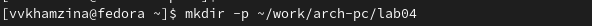{#fig:001 width=100%}

Перешла в созданный каталог с помощью утилиты cd (рис. @fig:002).

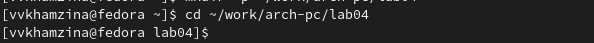{#fig:002 width=100%}

Создала текстовый файл hello.asm с помощью утилиты touch и открыла его через текстовый редактор gedit (рис. @fig:003).

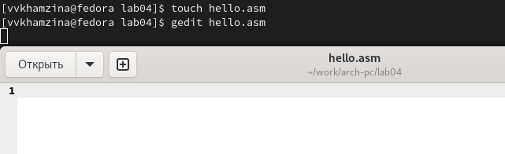{#fig:003 width=100%}

Заполнила файл, вставив программу для вывода "Hello world!" (рис. @fig:004).

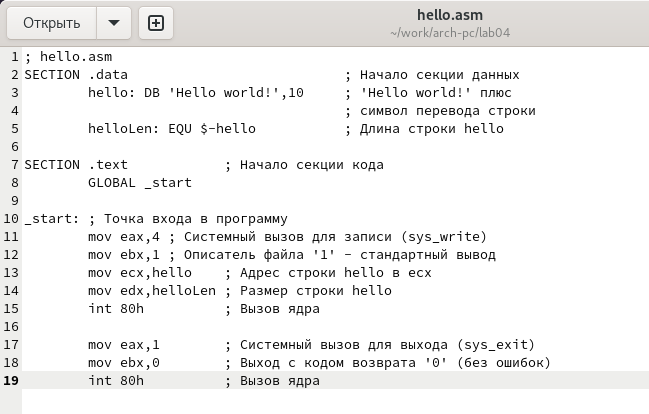{#fig:004 width=100%}

## Работа с транслятором NASM

Превращаю текст программы "Hello world!" с помощью транслятора NASM в объектный код. Текст набран без ошибок, преобразованный текст программы записался в файл hello.o (рис. @fig:005).

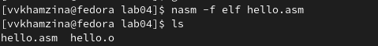{#fig:005 width=100%}

## Расширенный синтаксис командной строки NASM

Провела компиляцию файла hello.asm в obj.o, убедилась, что компиляция прошла успешно (рис. @fig:006).

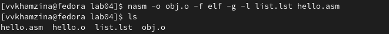{#fig:006 width=100%}

## Компоновщик LD

Передала объектный файл на обработку компоновщику, введя в терминал "ld -m elf_i386 hello.o -o hello". В данном случае ключ -o задает имя создаваемого исполняемого файла. Проверила правильность выполняемой команды с помощью утилиты ls (рис. @fig:007).

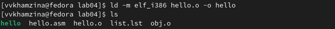{#fig:007 width=100%}

Выполнила команду "ld -m elf_i386 obj.o -o main". В этом случае из объектного файла obj.o будет собран исполняемый файл main (рис. @fig:008).

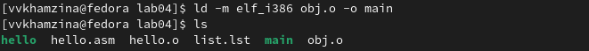{#fig:008 width=100%}

## Запуск исполняемого файла

Запустила на выполнение созданный исполняемый файл hello с помощью команды ./hello (рис. @fig:009).

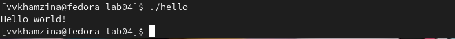{#fig:009 width=100%}

# Задание для самостоятельной работы

Создала переименованную копию файла hello.asm с помощью команды cd (рис. @fig:010).

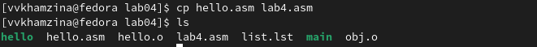{#fig:010 width=100%}

Внесла изменения в копию файла так, чтобы на экран выводилась строка с моими именем и фамилией(рис. @fig:011).

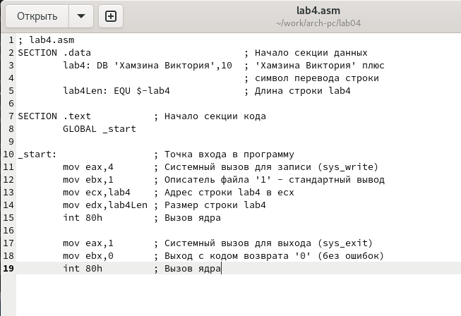{#fig:011 width=100%}

Провела трансляцию отредактированного текста в объектный файл (рис. @fig:012).

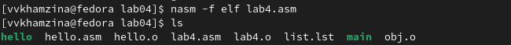{#fig:012 width=100%}

Выполнила компоновку объектного файла lab4.o (рис. @fig:013).

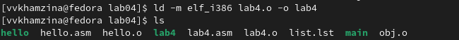{#fig:013 width=100%}

Запустила получившийся исполняемый файл, введя в терминал команду ./lab4 (рис. @fig:014).

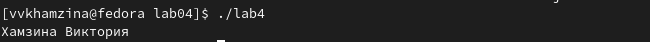{#fig:014 width=100%}

Скопировала файлы hello.asm и lab4.asm в каталог ~/work/study/2023-2024/"Архитектура компьютера"/arch-pc/labs/lab04/ и убедилась в успешности копирования (рис. @fig:015).

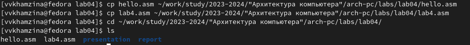{#fig:015 width=100%}

Загрузила файлы на Github (рис. @fig:016 - @fig:017).

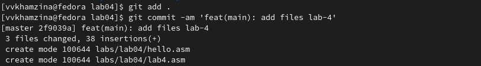{#fig:016 width=100%}

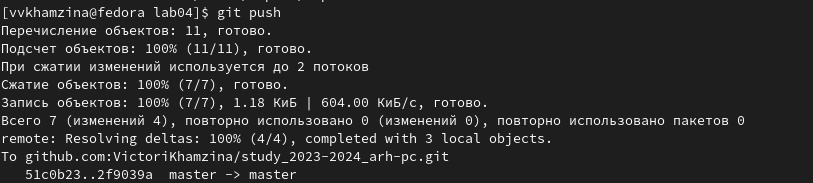{#fig:017 width=100%}

# Выводы

В ходе данной лабораторной работы я успешно освоила процедуры компиляции и сборки программ, написанных на ассемблере NASM.

