---
## Front matter
title: "Отчёт по лабораторной работе №5"
subtitle: "Дисциплина: архитектура компьютера"
author: "Хамзина Виктория Валентиновна"

## Generic otions
lang: ru-RU
toc-title: "Содержание"

## Bibliography
bibliography: bib/cite.bib
csl: pandoc/csl/gost-r-7-0-5-2008-numeric.csl

## Pdf output format
toc: true # Table of contents
toc-depth: 2
lof: true # List of figures
fontsize: 12pt
linestretch: 1.5
papersize: a4
documentclass: scrreprt
## I18n polyglossia
polyglossia-lang:
  name: russian
  options:
	- spelling=modern
	- babelshorthands=true
polyglossia-otherlangs:
  name: english
## I18n babel
babel-lang: russian
babel-otherlangs: english
## Fonts
mainfont: PT Serif
romanfont: PT Serif
sansfont: PT Sans
monofont: PT Mono
mainfontoptions: Ligatures=TeX
romanfontoptions: Ligatures=TeX
sansfontoptions: Ligatures=TeX,Scale=MatchLowercase
monofontoptions: Scale=MatchLowercase,Scale=0.9
## Biblatex
biblatex: true
biblio-style: "gost-numeric"
biblatexoptions:
  - parentracker=true
  - backend=biber
  - hyperref=auto
  - language=auto
  - autolang=other*
  - citestyle=gost-numeric
## Pandoc-crossref LaTeX customization
figureTitle: "Рис."
tableTitle: "Таблица"
listingTitle: "Листинг"
lofTitle: "Список иллюстраций"
lolTitle: "Листинги"
## Misc options
indent: true
header-includes:
  - \usepackage{indentfirst}
  - \usepackage{float} # keep figures where there are in the text
  - \floatplacement{figure}{H} # keep figures where there are in the text
---

# Цель работы

Приобрести практические навыки работы в Midnight Commander и освоить инструкции языка ассемблера mov и int.

# Выполнение лабораторной работы

Открыла Midnight Commander с помощью команды mc (рис. @fig:001).

{#fig:001 width=70%}

Перешла в каталог ~/work/arch-pc, созданный при выполнении лабораторной работы №4 (рис. @fig:002).

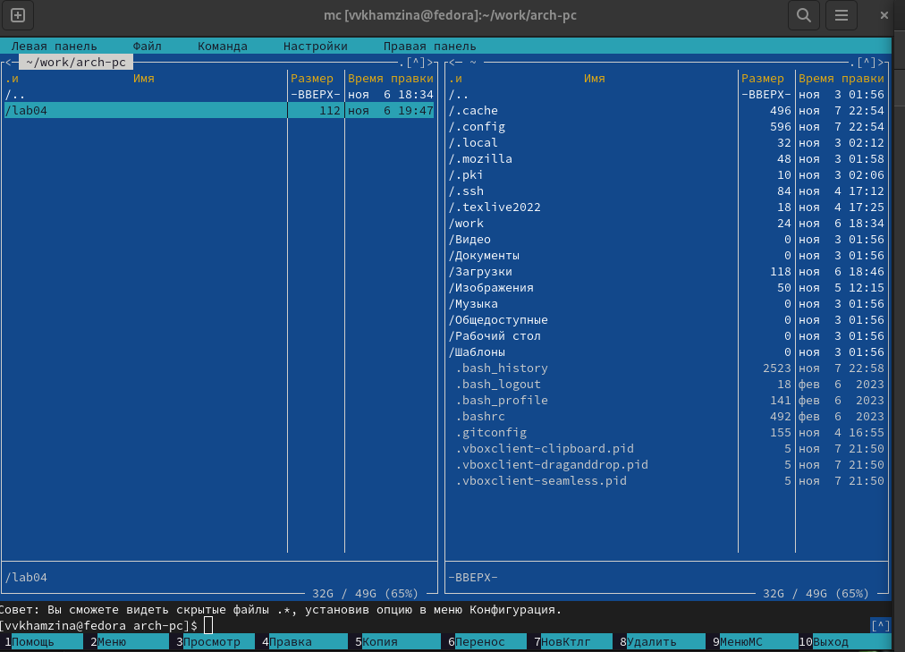{#fig:002 width=70%}

Создала каталог lab05 с помощью функциональной клавиши f7 и перешла в него (рис. @fig:003).

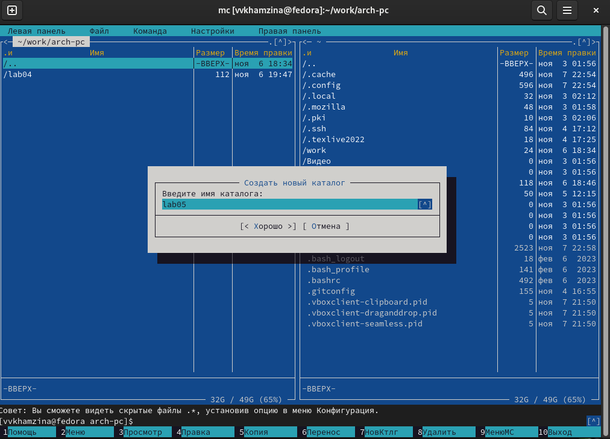{#fig:003 width=70%}

Создала файл lab5-1.asm, пользуясь строкой ввода и командой touch (рис. @fig:004).

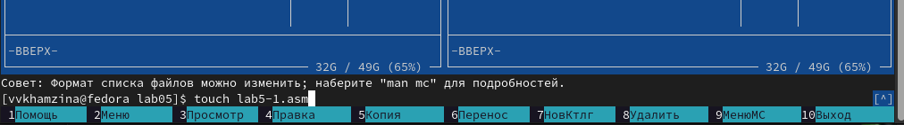{#fig:004 width=70%}

Открыла созданный файл через редактор mcedit с помощью функциональной клавиши f4 (рис. @fig:005).

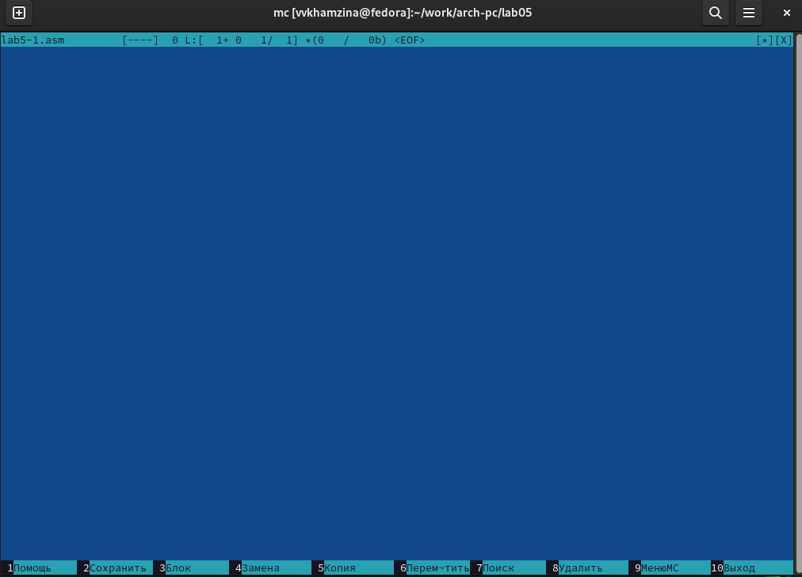{#fig:005 width=70%}

Ввела в открытый файл текст программы для вывода сообщения на экран и запроса строки у пользователя, сохранила изменения. Открыла файл с помощью функциональной клавиши f3 для просмотра (рис. @fig:006).

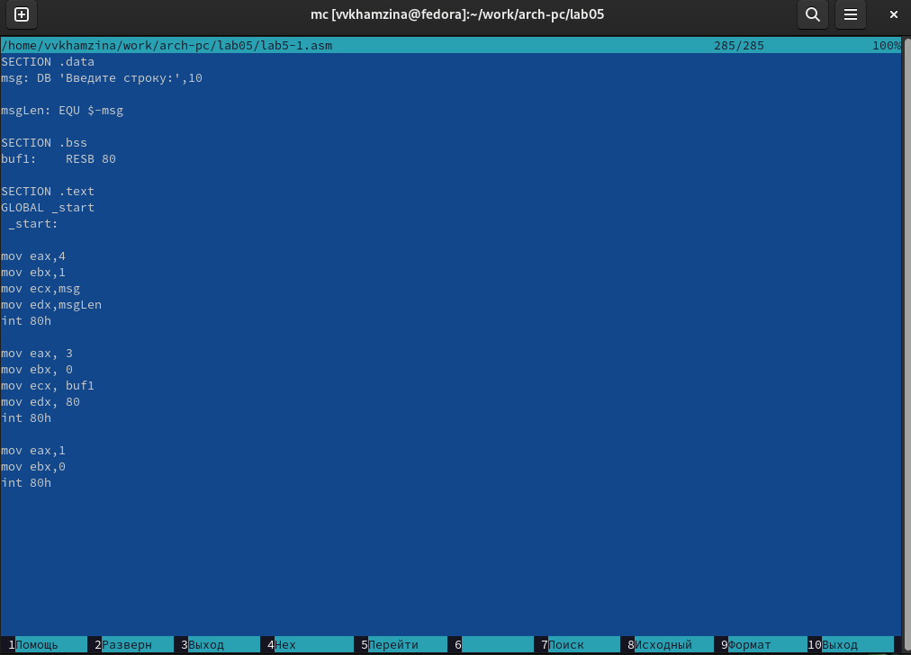{#fig:006 width=70%}

Транслировала файл lab5-1.asm в объектный командой nasm -f elf lab5-1.asm, выполнила компоновку объектногв исполняемый файл (рис. @fig:007).

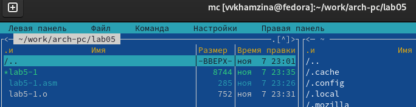{#fig:007 width=70%}

Запустила исполняемый файл lab5-1 (рис. @fig:008).

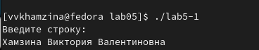{#fig:008 width=70%}

## Подключение внешнего файла in_out.asm

Скачала файл in_out.asm со страницы курса в ТУИС (рис. @fig:009).

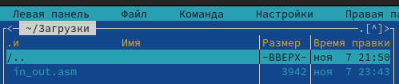{#fig:009 width=70%}

Открыла в левой панели каталог с файлом lab5-1.asm, а в другой каталог со скаченным файлом in_out.asm. Скопировала файл in_out.asm в каталог с файлом lab5-1.asm с помощью функциональной клавиши f5 (рис. @fig:010).

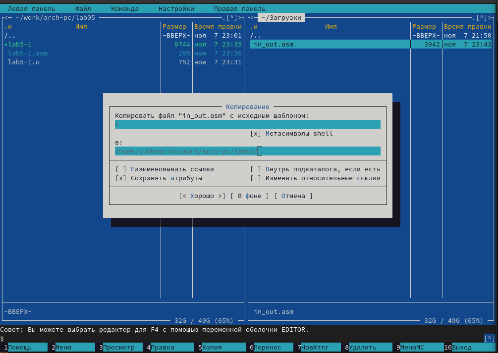{#fig:010 width=70%}

Создала копию файла lab5-1.asm и назвала ее lab5-2.asm (рис. @fig:011).

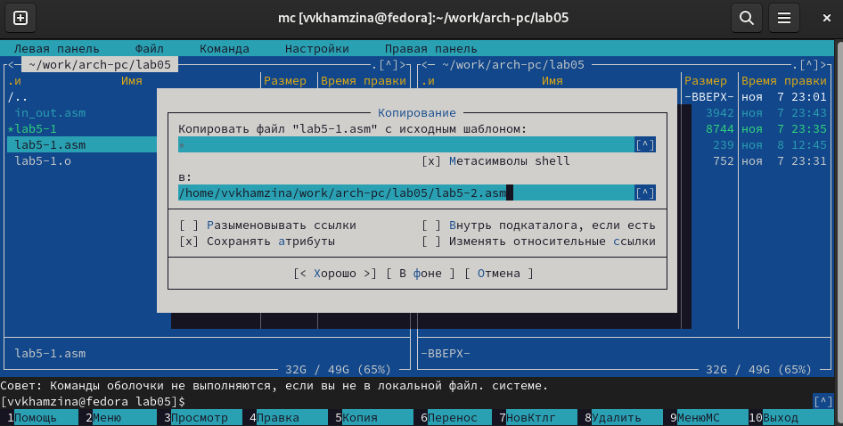{#fig:011 width=70%}

Отредактировала текст программы в файле lab5-2.asm с использованием подпрограмм из внешнего файла in_out.asm в соответствии с листингом 5.2 (рис. @fig:012).

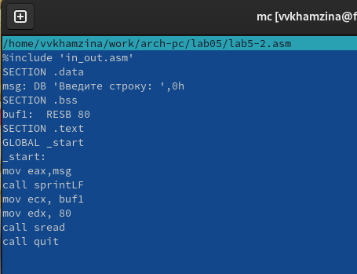{#fig:012 width=70%}

Создала объектный, а затем и исполняемый файлы (рис. @fig:013).

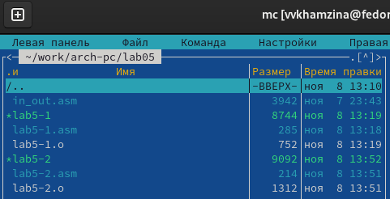{#fig:013 width=70%}

Запустила исполняемый файл lab5-2 (рис. @fig:014).

{#fig:014 width=70%}

Открыла файл lab5-2.asm с помощью функциональной клавиши f4, заменила подпрограмму sprintLF на sprint (рис. @fig:015).

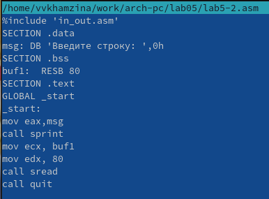{#fig:015 width=70%}

Снова создала исполняемый файл lab5-2 после редактирования и запустила его. Разница между подпрограммами sprintLF и sprint заключается в том, что sprint запрашивает ввод без переноса на новую строку (рис. @fig:016).

{#fig:016 width=70%}

# Задание для самостоятельной работы

Создала копию файла lab5-1.asm с помощью клавиши f5 и назвала его lab5-1-1.asm (рис. @fig:017).

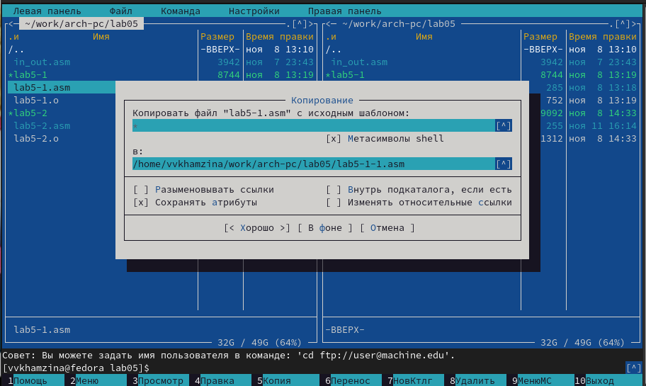{#fig:017 width=70%}

Внесла изменения в программу так, чтобы она выводила введенную строку на экран (рис. @fig:018).

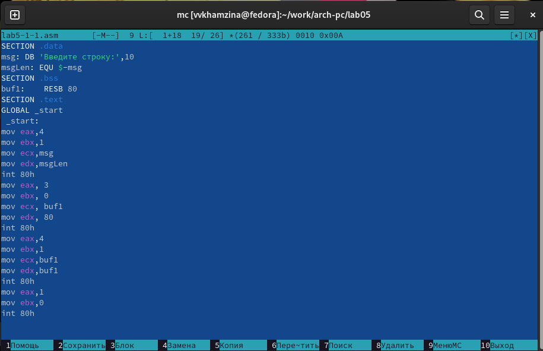{#fig:018 width=70%}

Код программы:

```NASM
SECTION .data ; Секция инициированных данных
msg: DB 'Введите строку:',10
msgLen: EQU $-msg ; Длина переменной 'msg'
SECTION .bss ; Секция не инициированных данных
buf1: RESB 80 ; Буфер размером 80 байт
SECTION .text ; Код программы
GLOBAL _start ; Начало программы
_start: ; Точка входа в программу
mov eax,4 ; Системный вызов для записи (sys_write)
mov ebx,1 ; Описатель файла 1 - стандартный вывод
mov ecx,msg ; Адрес строки 'msg' в 'ecx'
mov edx,msgLen ; Размер строки 'msg' в 'edx'
int 80h ; Вызов ядра
mov eax, 3 ; Системный вызов для чтения (sys_read)
mov ebx, 0 ; Дескриптор файла 0 - стандартный ввод
mov ecx, buf1 ; Адрес буфера под вводимую строку
mov edx, 80 ; Длина вводимой строки
int 80h ; Вызов ядра
mov eax,4 ; Системный вызов для записи (sys_write)
mov ebx,1 ; Описатель файла '1' - стандартный вывод
mov ecx,buf1 ; Адрес строки buf1 в ecx
mov edx,buf1 ; Размер строки buf1
int 80h ; Вызов ядра
mov eax,1 ; Системный вызов для выхода (sys_exit)
mov ebx,0 ; Выход с кодом возврата 0 (без ошибок)
int 80h ; Вызов ядра
```

Создала исполняемый файл lab5-1-1 и запустила его (рис. @fig:019).

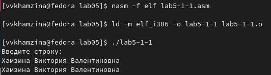{#fig:019 width=70%}

Создала копию файла lab5-2.asm с помощью клавиши f5 и назвала его lab5-2-1.asm (рис. @fig:020).

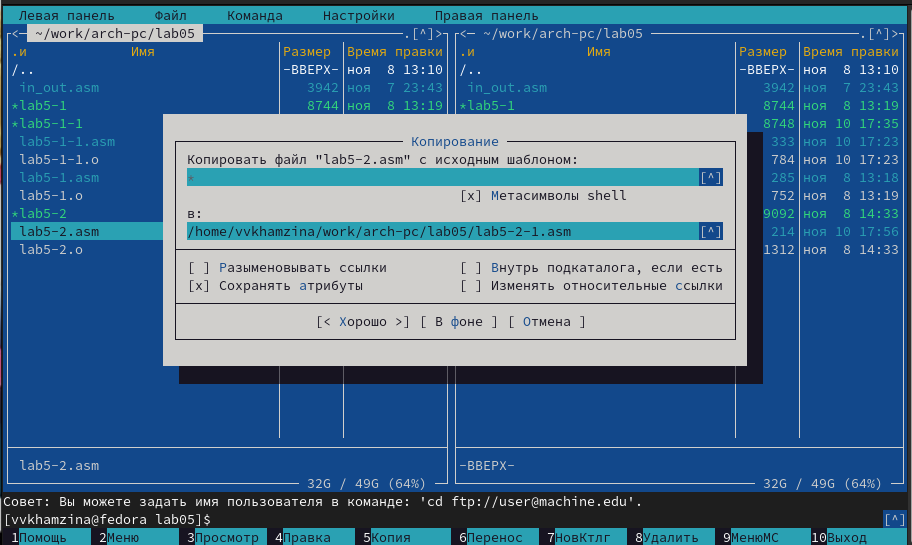{#fig:020 width=70%}

Внесла изменения в программу с использованием подпрограмм из внешнего файла in_out.asm так, чтобы она выводила введенную строку на экран (рис. @fig:021).

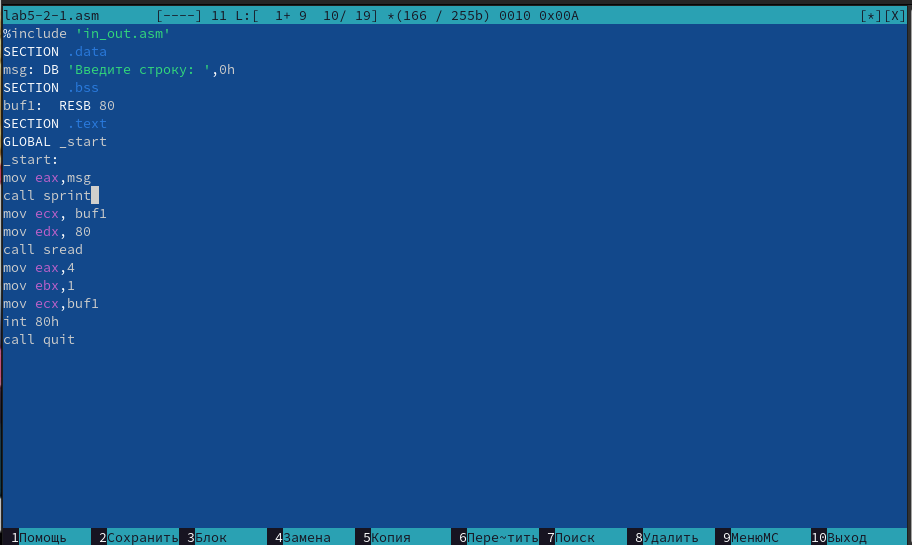{#fig:021 width=70%}

Код программы:

```NASM
%include 'in_out.asm'
SECTION .data ; Секция инициированных данных
msg: DB 'Введите строку: ',0h ; сообщение
SECTION .bss ; Секция не инициированных данных
buf1: RESB 80 ; Буфер размером 80 байт
SECTION .text ; Код программы
GLOBAL _start ; Начало программы
_start: ; Точка входа в программу
mov eax, msg ; запись адреса выводимого сообщения в `EAX`
call sprint ; вызов подпрограммы печати сообщения
mov ecx, buf1 ; запись адреса переменной в `EAX`
mov edx, 80 ; запись длины вводимого сообщения в `EBX`
call sread ; вызов подпрограммы ввода сообщения
mov eax,4 ; Системный вызов для записи (sys_write)
mov ebx,1 ; Описатель файла '1' - стандартный вывод
mov ecx,buf1 ; Адрес строки buf1 в ecx
int 80h ; Вызов ядра
call quit ; вызов подпрограммы завершения
```

Создала исполняемый файл lab5-2-1 и запустила его (рис. @fig:022).

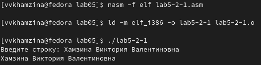{#fig:022 width=70%}

# Выводы

В ходе данной лабораторной работы я приобрела практические навыки работы в Midnight Commander и освоила инструкции языка ассемблера mov и int.


