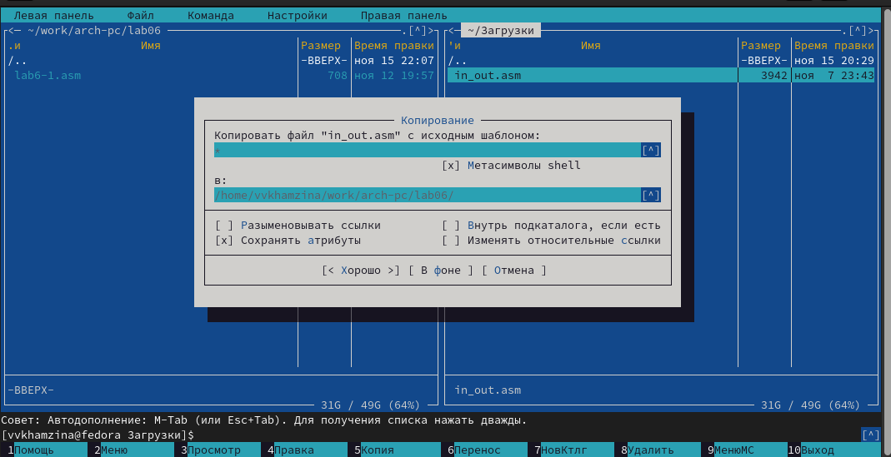
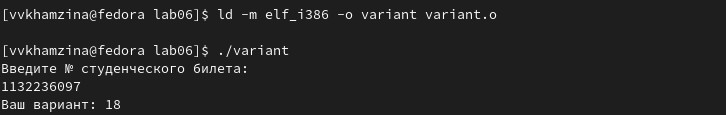

---
## Front matter
title: "Отчет по лабораторной работе №6"
subtitle: "Дисциплина: архитектура компьютера"
author: "Хамзина Виктория Валентиновна"

## Generic otions
lang: ru-RU
toc-title: "Содержание"

## Bibliography
bibliography: bib/cite.bib
csl: pandoc/csl/gost-r-7-0-5-2008-numeric.csl

## Pdf output format
toc: true # Table of contents
toc-depth: 2
lof: true # List of figures
fontsize: 12pt
linestretch: 1.5
papersize: a4
documentclass: scrreprt
## I18n polyglossia
polyglossia-lang:
  name: russian
  options:
	- spelling=modern
	- babelshorthands=true
polyglossia-otherlangs:
  name: english
## I18n babel
babel-lang: russian
babel-otherlangs: english
## Fonts
mainfont: PT Serif
romanfont: PT Serif
sansfont: PT Sans
monofont: PT Mono
mainfontoptions: Ligatures=TeX
romanfontoptions: Ligatures=TeX
sansfontoptions: Ligatures=TeX,Scale=MatchLowercase
monofontoptions: Scale=MatchLowercase,Scale=0.9
## Biblatex
biblatex: true
biblio-style: "gost-numeric"
biblatexoptions:
  - parentracker=true
  - backend=biber
  - hyperref=auto
  - language=auto
  - autolang=other*
  - citestyle=gost-numeric
## Pandoc-crossref LaTeX customization
figureTitle: "Рис."
listingTitle: "Листинг"
lofTitle: "Список иллюстраций"
lolTitle: "Листинги"
## Misc options
indent: true
header-includes:
  - \usepackage{indentfirst}
  - \usepackage{float} # keep figures where there are in the text
  - \floatplacement{figure}{H} # keep figures where there are in the text
---

# Цель работы

Освоить арифметические инструкции языка ассемблера NASM.

# Выполнение лабораторной работы

## Символьные и численные данные в NASM

Создала каталог для программ лабораторной работы №6 и перешла в него. Создала файл lab6-1.asm с помощью команды touch (рис. @fig:001).

{#fig:001 width=70%}

Скопировала подключаемый файл in_out.asm в каталог ~/work/arch-pc/lab06 из директории ~/Загрузки для корректной работы программы с помощью файлового менеджера Midnight Commander (рис. @fig:002).

{#fig:002 width=70%}

Открыла файл lab6-1.asm  и ввела в него текст программы вывода значения регистра eax (рис. @fig:003).

{#fig:003 width=70%}

Создала исполняемый файл lab6-1 и запустила его. Программа вывела j, так как этот символ соответствует сумме двоичных кодов символов 4 и 6 в системе ASCII (рис. @fig:004).

{#fig:004 width=70%}

Изменила текст программы, записав в регистры eax и ebx вместо символов '6' и '4' цифры 6 и 4 (рис. @fig:005).

{#fig:005 width=70%}

Создала исполняемый файл после изменений текста программы и запустила его. Программа вывела символ с кодом 10 - символ перевода строки, который не отображается на экране (рис. @fig:006).

{#fig:006 width=70%}

Создала файл lab6-2.asm в директории ~/work/arch-pc/lab06 с помощью утилиты touch (рис. @fig:007).

{#fig:007 width=70%}

Ввела в созданный файл другой текст программы для вывода значения регистра eax (рис. @fig:008).

{#fig:008 width=70%}

Создала исполняемый файл и запустила его. Программа вывела число 106. Как и в прошлый раз это является суммой двоичных кодов 6 и 4, но функция iprintLF вывела уже число, а не символ, кодом которого является это число (рис. @fig:009).

{#fig:009 width=70%}

Изменила текст программы файла lab6-1, записав в регистры eax и ebx вместо символов '6' и '4' цифры 6 и 4 (рис. @fig:010).

{#fig:010 width=70%}

Создала исполняемый файл и запустила его. Программа вывела число 10, так как сложила сами числа, а не их двоичные коды (рис. @fig:011).

{#fig:011 width=70%}

Заменила в тексте программы функцию iprintLF на iprint (рис. @fig:012).

{#fig:012 width=70%}

Создала исполняемый файл после изменений текста программы и запустила его. Теперь программа не переводит строку после вывода 10 (рис. @fig:013).

{#fig:013 width=70%}

## Выполнение арифметических операций в NASM

Создала файл lab6-3.asm в каталоге ~/work/arch-pc/lab06 (рис. @fig:014).

{#fig:014 width=70%}

Ввела в созданный файл программу вычисления выражения f(x)=(5*2+3)/3 (рис. @fig:015).

{#fig:015 width=70%}

Создала исполняемый файл и запустила его (рис. @fig:016).

{#fig:016 width=70%}

Изменила текст программы файла lab6-3.asm так, чтобы программы вычисляла значение выражения f(x)=(4*6+2)/5 (рис. @fig:017).

{#fig:017 width=70%}

Создала исполняемый файл после изменений текста программы и запустила его (рис. @fig:018).

{#fig:018 width=70%}

Создала файл variant.asm с помощью утилиты touch (рис. @fig:019).

{#fig:019 width=70%}

Ввела в созданный файл программу для вычисления варианта задания по номеру студенческого билета (рис. @fig:020).

{#fig:020 width=70%}

Создала и запустила исполняемый файл variant (рис. @fig:021).

{#fig:021 width=70%}

## Ответы на вопросы

1. За вывод на экран сообщения 'Ваш вариант:' отвечают строки:
``` NASM
mov eax,rem
call sprint
```
2. Инструкция 'mov ecx,x' используется для записи адреса вводимой переменной x в регистр ecx, 'mov edx, 80' - для записи длины вводимого сообщения в регистр edx. 'call sread' вызывает подпрограмму ввода сообщения с клавиатуры.
3. 'Call atoi' используется для преобразования ASCII кода символа в число и записи результата в регистр eax.
4. За вычисление варианта отвечают следующие строки:
``` NASM
xor edx,edx
mov ebx,20
div ebx
inc edx
```
5. При выполнении инструкции 'div ebx' остаток от деления записывается в регистр edx.
6. Инструкция 'inc edx' используется для увеличения значения, записанного в регистр edx, на 1.
7. За вывод на экран результата вычислений отвечают следующие строки:
``` NASM
mov eax,edx
call iprintLF
```

## Задание для самостоятельной работы

Создала файл lab6-4.asm (рис. @fig:022).

{#fig:022 width=70%}

Написала текст программы для вычисления выражения под вариантом 18, так как он попался мне по номеру моего студенческого билета (рис. @fig:023).

{#fig:023 width=70%}

Код программы для вычисления выражения 18. 3(х+10)-20

``` NASM
%include 'in_out.asm' ;Подключение внешнего файла
SECTION .data ;Секция инициированных данных
rem: DB 'Выражение для вычисления: 3(x+10)-20',0
msg: DB 'Введите значение переменной x: ',0
SECTION .bss ;Секция неинициированных данных
buf1: RESB 80 ;Буфер размером 80 байт
SECTION .text ;Код программы
GLOBAL _start ;Начало программы
_start: ;Точка входа в программу
mov eax,rem ;Запись адреса выводимого сообщения в 'EAX'
call sprintLF ;Вызов подпрограммы печати сообщения
mov eax,msg ;Запись адреса выводимого сообщения в 'EAX'
call sprint ;Вызов подпрограммы печати сообщения
mov ecx,x ;Запись адреса переменной в 'ECX'
mov edx,80 ;Запись длины вводимого сообщения в 'EDX'
call sread ;Вызов подпрограммы ввода сообщения
mov eax,x ;Вызов подпрограммы преобразования
call atoi ;ASCII кода в число, 'eax = x'
add eax,10 ;EAX = EAX + 10
mov ebx,3 ;EBX = 3
mul ebx ;EAX = EAX * EBX
add eax,-20 ;EAX = EAX - 20
mov edi,eax ;Запись результата вычислений в 'edi'
mov eax,div ;Вызов подпрограммы печати
call sprint ;Сообщение 'Результат: '
mov eax,edi ;Вызов подпрограммы печати значения
call iprintLF ;Из 'edi' в виде символов
call quit ;Вызов подпрограммы завершения
```

Создала исполняемый файл и проверила его работу, подставив два значения x (рис. @fig:024).

{#fig:024 width=70%}

# Выводы

В ходе данной лабораторной работы я освоить арифметические инструкции языка ассемблера NASM.

