---
## Front matter
title: "Отчёт по лабораторной работе №7"
subtitle: "Дисциплина: архитектура компьютера"
author: "Хамзина Виктория Валентиновна"

## Generic otions
lang: ru-RU
toc-title: "Содержание"

## Bibliography
bibliography: bib/cite.bib
csl: pandoc/csl/gost-r-7-0-5-2008-numeric.csl

## Pdf output format
toc: true # Table of contents
toc-depth: 2
lof: true # List of figures
fontsize: 12pt
linestretch: 1.5
papersize: a4
documentclass: scrreprt
## I18n polyglossia
polyglossia-lang:
  name: russian
  options:
	- spelling=modern
	- babelshorthands=true
polyglossia-otherlangs:
  name: english
## I18n babel
babel-lang: russian
babel-otherlangs: english
## Fonts
mainfont: PT Serif
romanfont: PT Serif
sansfont: PT Sans
monofont: PT Mono
mainfontoptions: Ligatures=TeX
romanfontoptions: Ligatures=TeX
sansfontoptions: Ligatures=TeX,Scale=MatchLowercase
monofontoptions: Scale=MatchLowercase,Scale=0.9
## Biblatex
biblatex: true
biblio-style: "gost-numeric"
biblatexoptions:
  - parentracker=true
  - backend=biber
  - hyperref=auto
  - language=auto
  - autolang=other*
  - citestyle=gost-numeric
## Pandoc-crossref LaTeX customization
figureTitle: "Рис."
listingTitle: "Листинг"
lofTitle: "Список иллюстраций"
lolTitle: "Листинги"
## Misc options
indent: true
header-includes:
  - \usepackage{indentfirst}
  - \usepackage{float} # keep figures where there are in the text
  - \floatplacement{figure}{H} # keep figures where there are in the text
---

# Цель работы

Изучить команды условного и безусловного переходов, приобрести навыки написания
программ с их использованием. Познакомиться с назначением и структурой файла
листинга.


# Выполнение лабораторной работы

## Реализация переходов в NASM

Создала каталог для данной лабораторной работы с помощью команды mkdir ~/work/arch-pc/lab07, перешла в него и создала файл lab7-1.asm (рис. @fig:001).

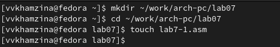{#fig:001 width=100%}

Ввела в файл текст программы, в которой используется инструкция jmp (рис. @fig:002).

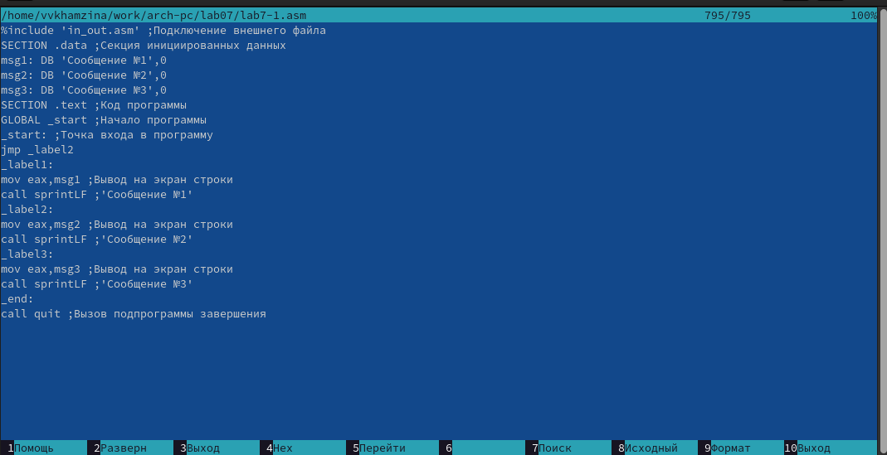{#fig:002 width=100%}

Создала исполняемый файл lab7-1 и проверила его работу (рис. @fig:003).

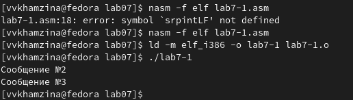{#fig:003 width=100%}

Изменила текст программы таким образом, чтобы она сначала выводила 'Сообщение №2', а потом 'Сообщение №1' и завершала работу (рис. @fig:004).

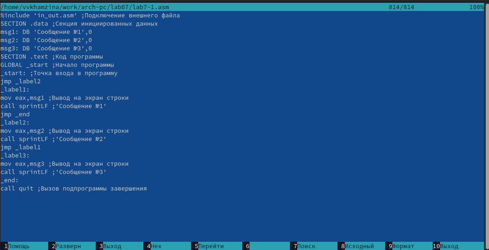{#fig:004 width=100%}

Создала исполняемый файл после редактирования текста программы и проверила его работу (рис. @fig:005).

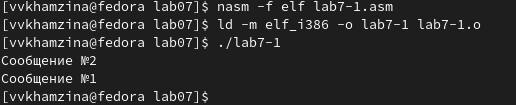{#fig:005 width=100%}

Изменила текст программы в файле lab7-1.asm так, чтобы она выводила сообщения в обратном порядке (рис. @fig:006).

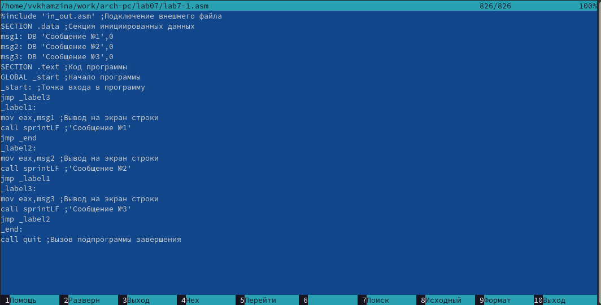{#fig:006 width=100%}

Создала исполняемый файл после изменения текста программы и запустила его (рис. @fig:007).

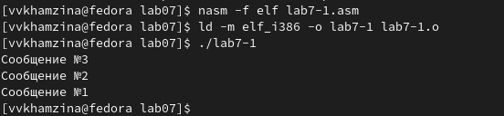{#fig:007 width=100%}

Создала файл lab7-2.asm в каталоге ~/work/arch-pc/lab07 (рис. @fig:008).

{#fig:008 width=100%}

Ввела в файл lab7-2.asm текст программы, которая определяет и выводит на экран наибольшую из 3 целочисленных переменных: А, В и С (рис. @fig:009).

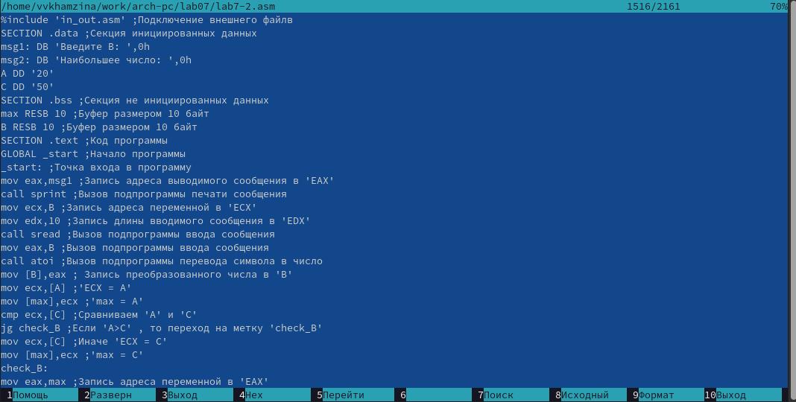{#fig:009 width=100%}

Создала исполняемый файл lab7-2 и проверила его работу для разных значений В (рис. @fig:010).

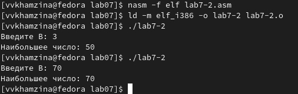{#fig:010 width=100%}

## Изучение структуры файла листинга

Создала файл листинга для программы из файла lab7-2.asm с помощью команды nasm -f elf -l lab7-2.lst lab7-2.asm и открыла его с помощью текстового редактора mcedit (рис. @fig:011).

{#fig:011 width=100%}

Рассмотрим строки 11, 14 и 23 и объясним их содержимое. (рис. @fig:012).

В строке 11 содержится номер строки [11], адрес [00000009], машинный код [EBF8] и содержимое строки кода [jmp nextchar]. В строке 14 содержится ее номер, адрес [0000000B], машинный код [29D8], содержимое - [sub eax,ebx]. В 23 строке адрес [0000000F], машинный код [52] и содержимое [push edx].

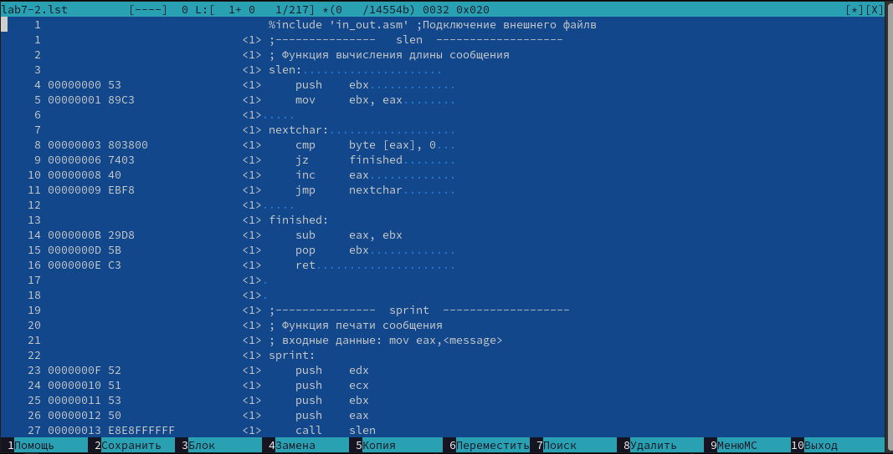{#fig:012 width=100%}

Удалила один из операндов инструкции mov (рис. @fig:013).

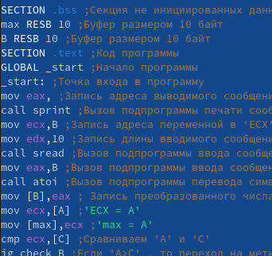{#fig:013 width=60%}

Выполнила трансляцию с получением файла листинга командой nasm -f elf -l lab7-2.lst lab7-2.asm. Описание намеренно созданной ошибки появилось в файле листинга (рис. @fig:014).

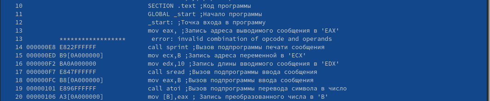{#fig:014 width=100%}

# Задание для самостоятельной работы

Создала файл lab7-3.asm (рис. @fig:015).

{#fig:015 width=100%}

Написала в созданном файле текст программы для нахождения наименьшей из 3 целочисленных переменных А, В и С. Взяла значения переменных варианта 18, так как этот вариант мне достался в ходе выполнения предыдущей лабораторной работы (рис. @fig:016).

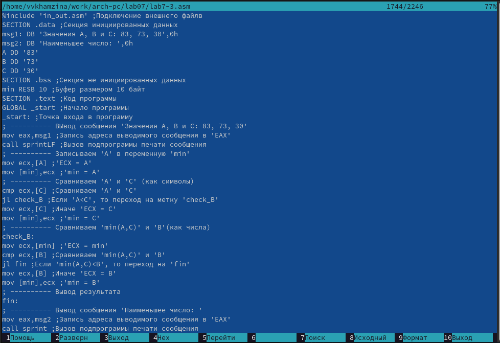{#fig:016 width=100%}

``` NASM
%include 'in_out.asm' ;Подключение внешнего файла
SECTION .data ;Секция инициированных данных
msg1: DB 'Значения А, В и С: 83, 73, 30',0h
msg2: DB 'Наименьшее число: ',0h
A DD '83'
B DD '73'
C DD '30'
SECTION .bss ;Секция не инициированных данных
min RESB 10 ;Буфер размером 10 байт
SECTION .text ;Код программы
GLOBAL _start ;Начало программы
_start: ;Точка входа в программу
; ---------- Вывод сообщения 'Значения А, В и С: 83, 73, 30'
mov eax,msg1 ;Запись адреса выводимого сообщения в 'EAX'
call sprintLF ;Вызов подпрограммы печати сообщения
; ---------- Записываем 'A' в переменную 'min'
mov ecx,[A] ;'ECX = A'
mov [min],ecx ;'min = A'
; ---------- Сравниваем 'A' и 'C' (как символы)
cmp ecx,[C] ;Сравниваем 'A' и 'C'
jl check_B ;Если 'A<C', то переход на метку 'check_B'
mov ecx,[C] ;Иначе 'ECX = C'
mov [min],ecx ;'min = C'
; ---------- Сравниваем 'min(A,C)' и 'B' (как числа)
check_B:
mov ecx,[min] ;'ECX = min'
cmp ecx,[B] ;Сравниваем 'min(A,C)' и 'B'
jl fin ;Если 'min(A,C)<B', то переход на 'fin'
mov ecx,[B] ;Иначе 'ECX = B'
mov [min],ecx ;'min = B'
; ---------- Вывод результата
fin:
; ---------- Вывод сообщения 'Наименьшее число: '
mov eax,msg2 ;Запись адреса выводимого сообщения в 'EAX'
call sprint ;Вызов подпрограммы печати сообщения
; ---------- Преобразование 'min' из символа в число
mov eax,min ;Запись адреса переменной в 'EAX'
call atoi ;Вызов подпрограммы перевода символа в число
mov [min],eax ;Запись преобразованного числа в 'min'
mov eax,[min] ;Запись адреса пременной в 'EAX'
call iprintLF ;Вывод 'min(A,B,C)'
call quit ;Вызов подпрограммы завершения
```

Создала исполняемый файл и проверила его работу (рис. @fig:017).

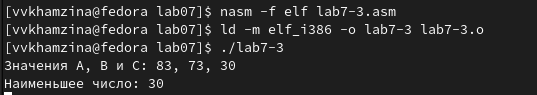{#fig:017 width=100%}

Создала файл lab7-4.asm (рис. @fig:018).

{#fig:018 width=100%}

Написала программу вычисления значения заданной функции для введенных с клавиатуры x и a (рис. @fig:019).

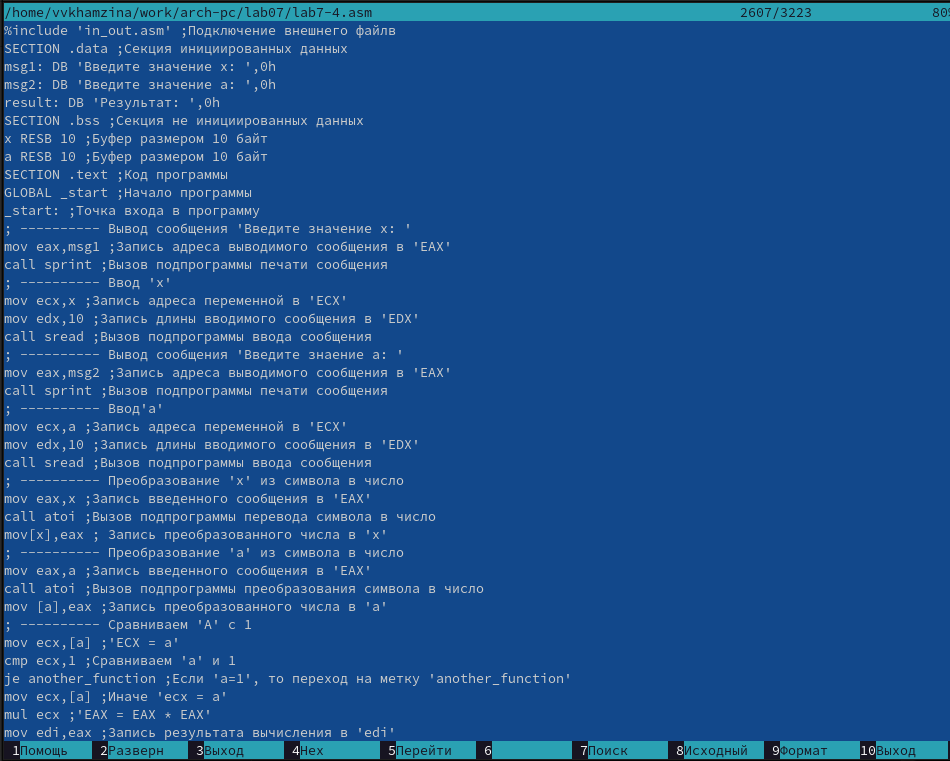{#fig:019 width=100%}

``` NASM
%include 'in_out.asm' ;Подключение внешнего файла
SECTION .data ;Секция инициированных данных
msg1: DB 'Введите значение х: ',0h
msg2: DB 'Введите значение a: ',0h
result: DB 'Результат: ',0h
SECTION .bss ;Секция не инициированных данных
x RESB 10 ;Буфер размером 10 байт
a RESB 10 ;Буфер размером 10 байт
SECTION .text ;Код программы
GLOBAL _start ;Начало программы
_start: ;Точка входа в программу
; ---------- Вывод сообщения 'Введите значение х: '
mov eax,msg1 ;Запись адреса выводимого сообщения в 'EAX'
call sprint ;Вызов подпрограммы печати сообщения
; ---------- Ввод 'x'
mov ecx,x ;Запись адреса переменной в 'ECX'
mov edx,10 ;Запись длины вводимого сообщения в 'EDX' 
call sread ;Вызов подпрограммы ввода сообщения
; ---------- Вывод сообщения 'Введите значение х: '
mov eax,msg2 ;Запись адреса выводимого сообщения в 'EAX'
call sprint ;Вызов подпрограммы печати сообщения
; ---------- Ввод 'a'
mov ecx,a ;Запись адреса переменной в 'ECX'
mov edx,10 ;Запись длины вводимого сообщения в 'EDX' 
call sread ;Вызов подпрограммы ввода сообщения
; ---------- Преобразование 'x' из символа в число
mov eax,x ;Запись адреса переменной в 'EAX'
call atoi ;Вызов подпрограммы перевода символа в число
mov [x],eax ;Запись преобразованного числа в 'x'
; ---------- Преобразование 'a' из символа в число
mov eax,a ;Запись адреса переменной в 'EAX'
call atoi ;Вызов подпрограммы перевода символа в число
mov [a],eax ;Запись преобразованного числа в 'a'
; ---------- Сравниваем 'A' c 1
mov ecx, [a] ;'ECX = a'
cmp ecx,1 ;Сравниваем 'a' и 1
je another_function ;Если 'a=1', то переход на метку 'another_function'
mov ecx,[a] ;Иначе 'ECX = a'
mul ecx ; 'EAX = ECX * ECX'
mov edi,eax ;Запись результата вычисления в 'edi'
another_function:
mov eax,[x] ;'EAX = x'
add eax,10 ;'EAX = EAX + 10'
mov edi,eax ;Запись результата в 'edi'
; ---------- Вывод результата
fin:
mov eax,result ;Запись адреса выводимого сообщения в 'EAX'
call sprint ;Вызов подпрограммы печати сообщения
mov eax,edi ;Запись результата вычислений в 'EAX'
call iprintLF ;Вывод результата вычислений
call quit ;Вызов подпрограммы завершения
```
Создала исполняемый файл и запустила его для разных значений х и а (рис. @fig:020).

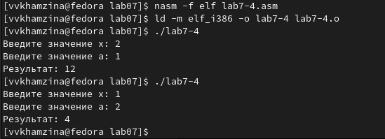{#fig:020 width=100%}

# Выводы

В ходе данной лабораторной работы я изучила команды условного и безусловного переходов, приобрела навыки написания программ с их использованием, а также познакомилась с назначением и структурой файла
листинга.


